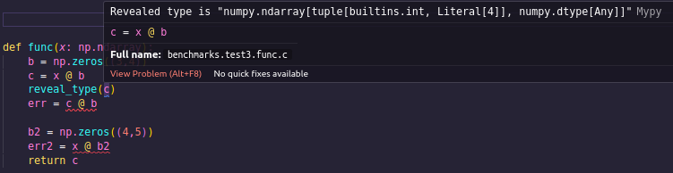
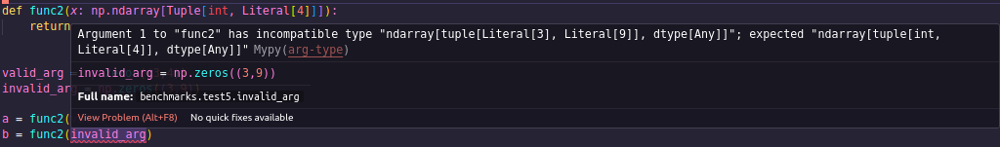
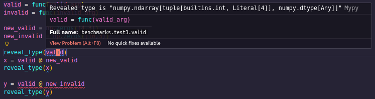

# Type System for Tensors
Note: For a much more in depth view, check out the (VERY WIP) paper [here](img/paper.pdf) \
Note2: To check out the plugin repo, click [here](https://github.com/arnav-jain1/mypy_plugin)

## Overview
This program is a plugin for MyPy that intercepts NumPy hooks and changes the types of ndarrays to one that represents its shape. This is done to reduce the amount of shape errors when programming.  When an operation is used, it uses the type to get the shape of the tensor and then uses Z3 to make sure the operation is compatible. \
The plugin covers many of the basic NumPy functions, but needs to be expanded to include more of them. I would also like to make it so that it covers PyTorch functions and can track data types as well. A brief showcase of the plugin can be found below the setup section 

A paper for this is still being made. Current work involves evaluating more open source code. 

## Setup 
To get it working in VS Code, clone the repo and add the following packages to your current enviornment.
```
mypy==1.18.2
mypy-extensions==1.1.0
z3-solver==4.15.3.0
```
Then in your `.vscode/settings.json` file, add these 2 lines. If you don't want your `mypy.ini` file to be in your working directory, change the path of it to where you want it to be
```json
{
    "mypy-type-checker.args": ["--config-file", "mypy.ini"],
    "mypy-type-checker.importStrategy": "fromEnvironment",
}
```
Create a `mypy.ini` file and add the following lines to it. Make sure to change the path to the `plugin.py` file
```ini
[mypy]

plugins = tensor_plugin/plugin.py

allow_untyped_globals = True
allow_redefinition = True
disable_error_code = var-annotated
check_untyped_defs = True
ignore_missing_imports = True
```

After that, you are good to go! The errors will start popping up soon!

## Showcase
This is a brief showcase showing the capabilities and drawbacks of the plugin.

The shape of a tensor will be represented with something like this (5, int, \[1,2]). 
    - The first dimension is a literal 5, meaning that dimension is known and is a 5. 
    - The second is an int meaning it is completely unknown. 
    - The third is a list of possible values. We know the dim is a 1 or a 2.
### Example 1
```python
x = np.array([[1,2,3], [4,5,6]])
y = np.zeros((3,4))
reveal_type(x)
reveal_type(y)
z = x @ y
reveal_type(z)
err = y @ x
reveal_type(err)
```
This is the most basic example of how the plugin works.  

Here, err should result in an error, and we can see here that our type system does catch it \


Errors like these can be caught when using matrix multiplication or broadcasting

### Example 2
```python
def func(x: np.ndarray):
    b = np.zeros((3,4))
    c = x @ b
    reveal_type(c)
    err = c @ b

    b2 = np.zeros((4,5))
    err2 = x @ b2
    return c

valid_arg = np.zeros((3,4))
invalid_arg = np.zeros((3,9))

valid = func(valid_arg)
invalid = func(invalid_arg)

new_valid = np.zeros((4,3))
new_invalid = np.zeros((10,3))

reveal_type(valid)
x = valid @ new_valid
reveal_type(x)

reveal_type(valid)
y = valid @ new_invalid
```
A much more complex example is shown here. 

- We have a function that takes in a tensor with an unknown shape. 
	- The default shape of a tensor is (int, int), but a tensor of a different rank, in this case 3, can be specified like so `np.ndarray[Tuple[int, int, int]]` 
- After the first operation, `c=x@b`, c is given the type shown below

- We also know that `x` can be updated to be (int, 3); however, since x is not being assigned anything, we cannot update the type and we have to store it internally. 
	- Storing internally works, though, as it gives an errorwhen it is being multiplied by `b2`


- Calling the function with an invalid argument as shown with `invalid = func(invalid_arg)` does **NOT** throw an error. This is because while we know what the type of the argument should be, we do not want to override the user's type annotation.
	- If the function were to instead have the type annotation `np.ndarray[Tuple[int,4]]`, then MyPy would indicate an error. 


- The type `valid` of valid will be the type of the return statement (in this case the variable `c`). It does **NOT** take the argument into account as this would be differing from MyPy's intended behavior. Additionally, if a type annotation is given, it will default to that. Once again, we don't want to be more strict than the user.
  

### Example 3
```python
def func2(x: np.ndarray[Tuple[int, Literal[4]]], a : int):
	y = x[0:a, :]
	reveal_type(y)
	z = x[0:4, 1:3]
	reveal_type(z)
	integer = x[0, 0]
	reveal_type(integer)
	return
```
This is an example of slicing working. We are unsure of what a or the first dim is.

- `y` has the shape (int, 4) which is the type that it is given
- `z` has a small issue. The shape should be (4,2) but the type it is given corresponds to a shape of (int, 2). This is because even though we know the first dimension will have a length of 4, since it slices an unknown dimension, the plugin currently assumes the output is unknown so keeps it an int. This will be fixed soon
- `x` is given the type of int. This is reserved as a placeholder until data types are working properly.

### Example 4
```python
def func(x: np.ndarray[Tuple[int, int]], y: np.ndarray[Tuple[int, int]]):
    err = x @ y
    return err

x = np.zeros((10,4))
y = np.zeros((5,8))

func(x, y)
```
The is an example of a bug the plugin can't catch

Since the parameters themselves aren't taken to account when determining compatibility (other than making sure they match with the signature), it is unable to catch this error.
